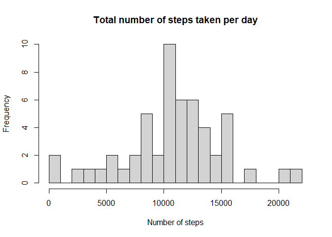
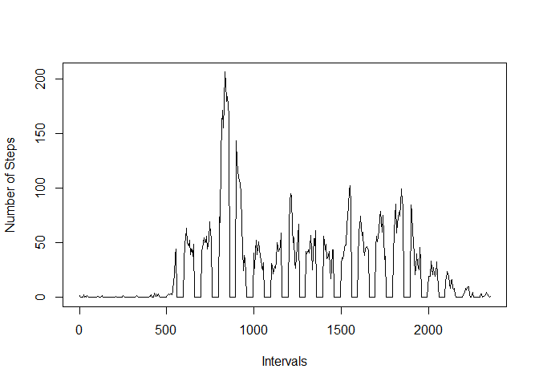
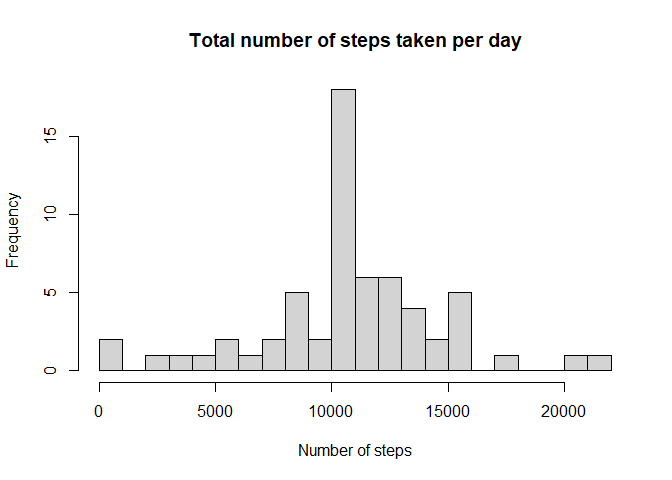
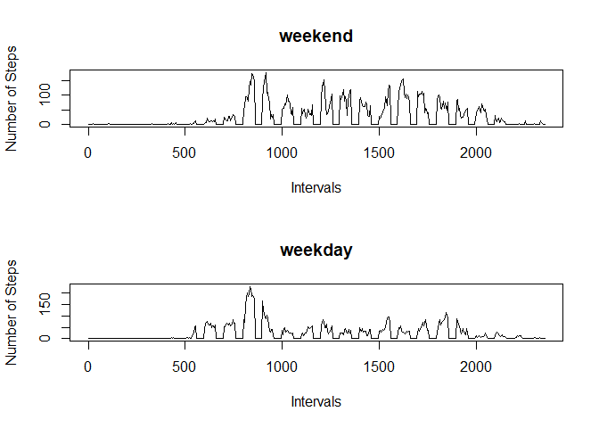

## Loading and preprocessing the data:

```r
data <- read.csv( "activity.csv" )
data <- data[!is.na(data[,1]),]
data[,"steps"] <- as.numeric(data[,"steps"])
```


## Mean total number of steps taken per day:

```r
df <- data.frame()

date <- data[1,"date"]
total <- 0
for( i in 1:nrow(data) ){
        if( date == data[i,"date"] ){
                total <- total + data[i,"steps"]
        }else{
                df <- rbind( df, data.frame( total_steps = total, 
                                             day = date) )
                total <- data[i,"steps"]
                date <- data[i,"date"]
        }
}
df <- rbind( df, data.frame( total_steps = total, day = date ) )
hist(df[,1], breaks = 20, main = "Total number of steps taken per day", 
     xlab = "Number of steps")
```

<!-- -->

```r
print(mean(sum(df[,1])))
```

```
## [1] 570608
```

```r
print(median(df[,1]))
```

```
## [1] 10765
```


## Average daily activity pattern:

```r
intervals <- c()
i <- 0
while( i <= 2355 ){
        intervals <- c( intervals, i )
        i <- i + 5
}
steps <- c()
for( i in intervals ){
        values <- data[data[,3] == i,1]
        average <- sum(values)/length(values)
        if( !is.nan(average) )
                steps <- c(steps, average)
        else
                steps <- c(steps, 0)
}
plot(intervals, steps, type = 'l', xlab = "Intervals", ylab = "Number of Steps" )
```

<!-- -->

```r
print(intervals[steps == max(steps)])
```

```
## [1] 835
```

## Imputing missing values

```r
data <- read.csv( "activity.csv" )
dataNa <- data[is.na(data[,1]),]
print(nrow(dataNa))
```

```
## [1] 2304
```

Replace the missing values for the mean of that interval.

```r
for( i in 1:nrow(data) ){
        if( is.na(data[i,1]) ){
                  data[i,1] <- steps[intervals == data[i,3]]
        }
}
```


```r
df <- data.frame()

date <- data[1,"date"]
total <- 0
for( i in 1:nrow(data) ){
        if( date == data[i,"date"] ){
                total <- total + data[i,"steps"]
        }else{
                df <- rbind( df, data.frame( total_steps = total, 
                                             day = date) )
                total <- data[i,"steps"]
                date <- data[i,"date"]
        }
}
df <- rbind( df, data.frame( total_steps = total, day = date ) )
hist(df[,1], breaks = 20, main = "Total number of steps taken per day", 
     xlab = "Number of steps")
```

<!-- -->

```r
print(mean(sum(df[,1])))
```

```
## [1] 656737.5
```

```r
print(median(df[,1]))
```

```
## [1] 10766.19
```
The mean and median differ from the first part.


## Differences in activity patterns between weekdays and weekends:

```r
days <- weekdays(as.POSIXct(data[,2], format = "%Y-%m-%d"))
data <- data[!is.na(days),]
days <- days[!is.na(days)]
factordays <- factor(days)
levels(factordays) <- c("weekend", "weekday", "weekday", "weekend",
                        "weekday", "weekday", "weekday" )
intervals <- c()
i <- 0
while( i <= 2355 ){
        intervals <- c( intervals, i )
        i <- i + 5
}
par(mfrow = c(2, 1))
factordays <- as.character(factordays)
for( type in c("weekend", "weekday") ){
        dt <- data[factordays == type,]
        
        steps <- c()
        for( i in intervals ){
                values <- dt[dt[,3] == i,1]
                average <- sum(values)/length(values)
                if( !is.nan(average) )
                        steps <- c(steps, average)
                else
                        steps <- c(steps, 0)
        }
        plot(intervals, steps, type = 'l', xlab = "Intervals",
             ylab = "Number of Steps", main = type )
}
```

<!-- -->


